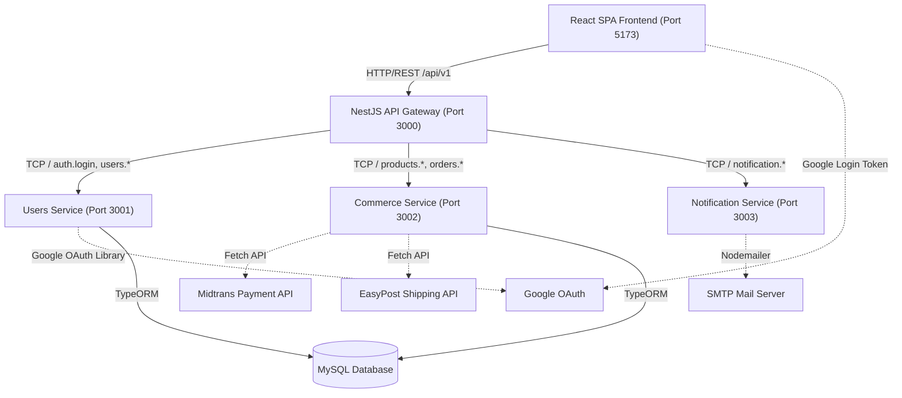

<p align="center">
  
</p>

---

## 1. Executive Summary & Overview

**LARASANA** is a premium digital e-commerce and cultural storytelling platform dedicated to traditional Lombok handwoven fabrics (Tenun Lombok). The platform serves as a modern bridge, transforming ancestral textile craftsmanship into contemporary ready-to-wear high fashion. 

Beyond standard e-commerce features, LARASANA weaves a rich narrative layer around each garment (Artisan Storytelling) and highlights the ecological and socio-economic impact (Eco-Social Impact) of the purchase. Every thread tells a story of heritage, and every transaction directly supports the native artisan communities of Lombok, Indonesia, ensuring that their century-old craft survives and thrives in the global marketplace.

---

## 2. Core Technology Stack

The platform is engineered using a decoupled, service-oriented architecture designed to handle concurrent operations, secure payment processing, and high-fidelity motion layouts.

### A. Frontend (Client-Side)
* **Core Framework**: **React 19.x** (utilizing functional component models, advanced hook architectures, and concurrent rendering).
* **Language Platform**: **TypeScript 6.x** (ensures strict compile-time type safety across complex cart states, order payloads, and API interfaces).
* **Build Tooling**: **Vite 8.x** (leverages native ES modules for ultra-fast compilation, hot module replacement, and optimized production bundling).
* **State & Navigation Routing**: **React Router DOM 7.x** (provides client-side routing, protected admin route guards, and browser history transitions).
* **Motion & UX Engineering**:
  * **Lenis 1.x**: Overrides default browser scroll-physics with inertia-based smooth scrolling, creating a premium luxury feel.
  * **Framer Motion 11.x**: Drives micro-interactions, layout morphing, staggered element card dealing, and page entrance animations.
  * **ScrollReveal 4.x**: Controls staggered, viewport-triggered element reveal behaviors on container entry.
* **SEO & Metadata**: **React Helmet Async 2.x** (injects page titles, meta descriptions, and OpenGraph tags dynamically per route).
* **API Client**: **Axios 1.16.x** (configured as a singleton with custom interceptor hooks to coordinate gateways).

### B. Backend (Server-Side)
* **Core Framework**: **NestJS 10.x** (a progressive Node.js framework building modular, enterprise-grade server-side architectures).
* **Monorepo Architecture**: Nest CLI monorepo workspace (segregates independent applications from shared libraries).
* **Internal Microservice Broker**: **TCP Transport Protocol** (NestJS native microservice TCP communication to enable low-overhead, fast internal messaging).
* **Database & ORM**:
  * **Database Engine**: **MySQL** / MariaDB (schema constraints, foreign keys, and indexes are restored via `larasana_db.sql`).
  * **ORM**: **TypeORM 0.3.x** / `@nestjs/typeorm` (manages schema synchronization, data-mapper queries, and transaction tables).
* **Security & Authentication**:
  * Hashing credentials via `bcrypt` (adaptive salt-rounds hashing).
  * JSON Web Tokens (JWT) using Passport strategies (Access Token [15 min expiry] and DB-persisted Refresh Token [7 day expiry] flow).
  * Authentication guards managed via `@nestjs/passport` and `passport-jwt`.
* **Transactional Emailing**: **Nodemailer 6.x** (connects to SMTP engines to send secure HTML OTPs and Password Reset links).

### C. Third-Party Integrations
* **Payment Gateway**: **Midtrans API** (Snap API for redirection, and Core API for direct Virtual Account integrations including BCA, BNI, BRI, Mandiri, Gopay, and ShopeePay).
* **Logistics & Rates**: **EasyPost API** (queries shipping details, package dimensions, and weight variables to determine international carrier rates).
* **Identity Provider**: **Google OAuth Library** (`google-auth-library` for secure token decryption and verification on SSO login requests).

---

## 3. System Architecture & Service Layout

LARASANA utilizes a **Decoupled Single Page Application (SPA) & Microservices Backend** architecture. Below is the system blueprint representing how components interact:



### A. Frontend Architecture
The client is structured as a client-side routed SPA. The root layout is decorated with global contexts using the Provider Pattern (`HelmetProvider` -> `BrowserRouter` -> `SmoothScroll`). Logic modules are encapsulated inside container pages, which interface with presentational UI components.

### B. Backend Microservices Architecture
The backend services are partitioned into four distinct runtimes:
1. **API Gateway (Port 3000)**: Renders the REST API endpoints (`/api/v1`) to the client. Serves as the orchestrating proxy that routes incoming HTTP requests to internal services via TCP. It maps RPC validation schemas (`ValidationPipe`), controls CORS policies, handles JWT authentication, and exposes the **Swagger API Docs** (`/api/docs`).
2. **Users Service (Port 3001)**: Resolves user accounts, manages registrations, hashes credentials, coordinates Google Login tokens, and aggregates admin control operations (user/seller reviews and dashboard stats).
3. **Commerce Service (Port 3002)**: Powers the shop catalog. Controls product stocks, favorites lists, user shipping addresses, courier rates, checkout processes, and payment gateway interactions.
4. **Notification Service (Port 3003)**: Operates independently to construct and email transactional OTP tokens and reset links to customers.

---

## 4. Software Design Patterns

The frontend codebase adopts structured design patterns to maintain separation of concerns and robust data handling:

* **Singleton Pattern**:
  * *API Connection*: The Axios instance in [client.ts](file:///d:/LARASANA%20Updated/Frontend/frontend/src/api/client.ts) is instantiated once and shared globally.
  * *Script Loader*: The [googleScript.ts](file:///d:/LARASANA%20Updated/Frontend/frontend/src/utils/googleScript.ts) helper caches the loading state of the Google Identity Services library to ensure only one `<script>` tag is appended to the document body.
  * *SmoothScroll Engine*: A single `Lenis` instance is cached inside a React Reference and driven by a single requestAnimationFrame loop.
* **Interceptor Pattern**:
  * Integrated directly into Axios. The *Request Interceptor* checks local storage and appends the Authorization Bearer Token. The *Response Interceptor* cleans local memory and redirects the user if a `401 Unauthorized` token expiry occurs.
* **Observer Pattern**:
  * *Scroll Viewport Observer*: The [HeroShowcase.tsx](file:///d:/LARASANA%20Updated/Frontend/frontend/src/components/HeroShowcase.tsx) component uses the browser's `IntersectionObserver` to trigger card-entrance transitions when the section enters 30% visibility.
  * *Event Listeners*: Active listeners monitor browser resize and scroll events to dynamically update navbar styling and recalibrate Lenis heights.
* **Provider Pattern**:
  * Employs React Context Providers at the root level to distribute routing states, SEO metadata headers, and scrolling options without manual prop drilling.
* **Container / Presentational Component Pattern**:
  * Segregates logical container files (like `ProductDetailPage.tsx` which handles database fetches and URL parameter parsing) from pure visual presentational files (like [Product.tsx](file:///d:/LARASANA%20Updated/Frontend/frontend/src/components/Product.tsx) which handles rendering and local UI interactions).

---

## 5. Transaction & Payment Data Flow

The checkout transaction sequence coordinates third-party shipping and payment APIs. Below is the sequential process flow showing interactions:

```mermaid
sequenceDiagram
    autonumber
    actor User as Buyer (Frontend)
    participant GW as API Gateway (NestJS)
    participant CS as Commerce Service
    participant EP as EasyPost API
    participant MD as Midtrans API
    participant DB as MySQL DB

    User->>GW: 1. Post Address Details
    GW->>CS: (TCP) Forward Address Details
    CS->>DB: Save Address Records
    DB-->>CS: Address Saved Successfully
    
    rect rgb(30, 30, 30)
        note over CS, EP: Shipping Rate Resolution
        alt Country is International (Non-ID)
            CS->>EP: Request Shipping Rates (Weight & Address)
            EP-->>CS: Return DHL / FedEx / EMS Rates
        else Country is Domestic (Indonesia)
            CS->>DB: Query Domestic Courier Base Rates
            DB-->>CS: Return Local Courier Rates
        end
    end
    
    CS-->>GW: Return Available Shipping Options
    GW-->>User: Display Courier Options to Client
    
    User->>GW: 2. Trigger Checkout (Courier & Payment Method Selected)
    GW->>CS: (TCP) Forward Checkout Request
    CS->>DB: Create Pending Order (LRS-XXXX)
    
    rect rgb(30, 30, 30)
        note over CS, MD: Payment Gateway Integration
        CS->>MD: Request Payment Token (Snap / Charge API)
        MD-->>CS: Return QRIS String / VA Code / Redirect URL
    end
    
    CS->>DB: Save Transaction Token & Expiry (15 mins)
    CS-->>GW: Return Payment Credentials
    GW-->>User: Display QRIS / VA screen & Start 3s status polling loop
    
    loop 3s Polling
        User->>GW: Poll Order Payment Status
        GW->>CS: (TCP) Get Payment Status
        CS->>DB: Check Payment Logs
        DB-->>CS: Return Paid / Pending
        CS-->>GW: Return Status
        GW-->>User: Update UI / Redirect to Success if Paid
    end
```



### Transaction Lifecycle Steps:
1. **User Action**: The user selects a size on the Product Detail Page and clicks **Buy Now**.
2. **Checkout Validation**: The [CheckoutPage.tsx](file:///d:/LARASANA%20Updated/Frontend/frontend/src/pages/CheckoutPage.tsx) checks for active JWT tokens, validates local address inputs (Indonesian phone number patterns and minimum address length bounds), and retrieves user records.
3. **Logistics Rate Resolution**: Choosing or updating an address triggers a query to the `/shipping` API:
   * **International**: If the address country is not Indonesia (`ID`), the Commerce Service queries **EasyPost API** (`https://api.easypost.com/v2/shipments`) using the shipment's weight, generating real-time rates (DHL, FedEx, EMS).
   * **Domestic**: If domestic, the service queries local shipping methods directly from the MySQL database.
4. **Order Posting**: The user selects a courier and a payment type (QRIS / VA / Card) and clicks **Checkout Now**. The request is sent to the API Gateway, which proxies it to the Commerce Service via TCP.
5. **Gateway Payment Generation**: The Commerce Service records a pending order, computes total costs, and initiates a payload to **Midtrans API** (Snap endpoint for QRIS, or Core API `/charge` endpoint for Virtual Account details).
6. **Token Presentation**: Gateway responds with payment details (QRIS image URLs, VA numbers, or redirect links) which are displayed on the client.
7. **Expiry & Polling Loop**: The [PaymentPage.tsx](file:///d:/LARASANA%20Updated/Frontend/frontend/src/pages/PaymentPage.tsx) calculates a 15-minute countdown and spins up a polling loop (`setInterval` every 3 seconds) that queries `/checkout/payment-status/:orderId`.
8. **Confirmation Redirect**: When the user pays via their e-wallet or bank, Midtrans sends a secure signed webhook to the backend. The backend updates the order status. On the next polling cycle, the client detects the status change and redirects the user to `/payment-success`.

---

## 6. Directory Structure Mapping

### Frontend Directory Tree
```
frontend/
├── src/
│   ├── api/          # Axios client singleton & interceptors configuration
│   ├── assets/       # Promotional video, catalog images, and custom Didot fonts
│   ├── components/   # Navbar, Footer, SmoothScroll, SplashScreen, and layouts
│   ├── pages/        # Main route views (Landing, Product Detail, Checkout, Payment)
│   │   └── admin/    # Admin panel pages (dashboard metrics, product managers)
│   ├── style/        # Vanilla CSS stylesheets matched per page/component
│   └── utils/        # Dynamic script loaders, Google auth scripts, and alert helpers
├── package.json      # Dependencies (Vite 8, React 19, Framer Motion, Lenis)
└── vite.config.ts    # Bundler settings
```

### Backend Directory Tree
```
backendV2/
├── apps/
│   ├── api-gateway/  # Primary entry point (Swagger config, guards, RPC mapping)
│   ├── commerce-service/ # Products catalog, Shipping (EasyPost), and Payments (Midtrans)
│   ├── notification-service/ # Independent Nodemailer email dispatcher
│   └── users-service/    # Access controls, JWT auth strategy, Google login API
├── libs/
│   └── shared/       # Shared TypeORM schemas, DB configs, RPC TCP Constants
├── nest-cli.json     # NestJS monorepo compiler options
├── package.json      # Dependencies (NestJS 10, TypeORM, Concurrently, bcrypt)
└── larasana_db.sql   # Relational database structure and seed data
```

---

## 7. Local Installation & Development Configuration

### Prerequisites
* **Node.js**: Version 18.x or higher installed.
* **Database**: MySQL / MariaDB server running locally on port 3306.

### Setup Guide
1. **Database Restoration**:
   * Create a local database named `larasana_db`.
   * Import the initial structure and static seed records from the sql file:
     ```bash
     mysql -u root -p larasana_db < backendV2/larasana_db.sql
     ```
2. **Environment Configuration**:
   * Copy `backendV2/.env.example` into a new file named `backendV2/.env`.
   * Adjust connection parameters:
     ```env
     DB_HOST=localhost
     DB_PORT=3306
     DB_USERNAME=your_mysql_username
     DB_PASSWORD=your_mysql_password
     DB_NAME=larasana_db
     
     JWT_ACCESS_SECRET=your_long_access_secret_string
     JWT_REFRESH_SECRET=your_long_refresh_secret_string
     
     MIDTRANS_SERVER_KEY=your_midtrans_server_key
     MIDTRANS_IS_SANDBOX=true
     
     EASYPOST_API_KEY=your_easypost_test_key
     ```
3. **Launch Backend Services**:
   ```bash
   cd backendV2
   npm install
   npm run dev
   ```
   *Note: This command runs Concurrently to start the API Gateway, Users, Commerce, and Notification microservices simultaneously.*
4. **Launch Frontend Client**:
   ```bash
   cd ../frontend
   npm install
   npm run dev
   ```
   *Navigate to http://localhost:5173 inside your browser to open the application.*
