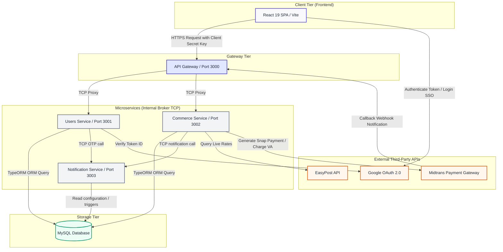
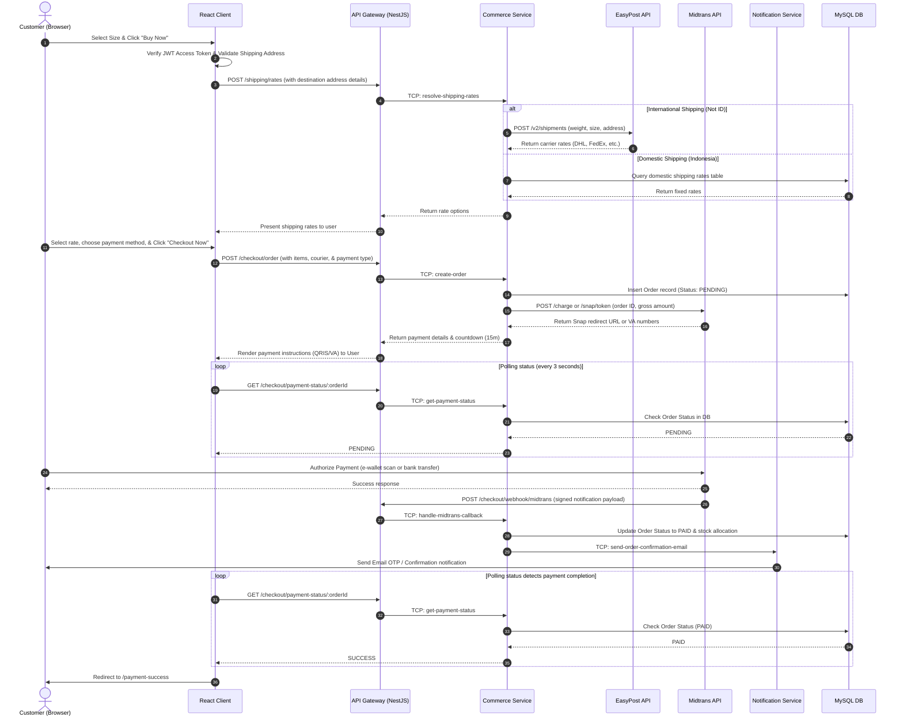

<p align="center">
  
</p>

<p align="center">
  <a href="https://github.com/SERAVEEM/Larasana-React-nest"></a>
  <a href="https://github.com/SERAVEEM/Larasana-React-nest"></a>
  <a href="https://github.com/SERAVEEM/Larasana-React-nest/pulls"></a>
  <a href="https://github.com/SERAVEEM/Larasana-React-nest/pulls"></a>
  <a href="https://github.com/SERAVEEM/Larasana-React-nest/blob/main/LICENSE"></a>
</p>

<p align="center">
  
  
  
  
  
  
  
</p>

---

# LARASANA — Technical Architecture & Security Manual

**LARASANA** is a premium digital e-commerce and cultural storytelling platform dedicated to traditional Lombok handwoven fabrics (Tenun Lombok). The platform serves as a modern bridge, transforming ancestral textile craftsmanship into contemporary ready-to-wear high fashion.

This document serves as the comprehensive technical manual detailing the system architecture, design patterns, security infrastructure, database mapping, and deployment guidelines for the LARASANA codebase.

---

## 1. Executive Summary & Overview

Beyond standard e-commerce features, LARASANA weaves a rich narrative layer around each garment (Artisan Storytelling) and highlights the ecological and socio-economic impact (Eco-Social Impact) of the purchase. Every thread tells a story of heritage, and every transaction directly supports the native artisan communities of Lombok, Indonesia, ensuring that their century-old craft survives and thrives in the global marketplace.

### Brand Identity & Creative Direction
The user interface is designed with a premium, high-contrast visual aesthetic utilizing high-fidelity motion graphics, immersive typography, and staggered layouts to evoke a luxury fashion house experience.

<p align="center">
  
</p>

---

## 2. Core Technology Stack

The platform is engineered using a decoupled, service-oriented architecture designed to handle concurrent operations, secure payment processing, and high-fidelity motion layouts.

### A. Frontend (Client-Side)
* **Core Framework**: **React 19.x** (utilizing functional component models, custom hooks, and concurrent rendering).
* **Language Platform**: **TypeScript 6.x** (ensures strict compile-time type safety across complex cart states, order payloads, and API interfaces).
* **Build Tooling**: **Vite 8.x** (leverages native ES modules for fast compilation, hot module replacement, and optimized production bundling).
* **State & Navigation Routing**: **React Router DOM 7.x** (provides client-side routing, protected admin route guards, and browser history transitions).
* **Motion & UX Engineering**:
  * **Lenis 1.x**: Overrides default browser scroll-physics with inertia-based smooth scrolling, creating a premium luxury feel.
  * **Framer Motion 11.x**: Drives micro-interactions, layout morphing, staggered element card dealing, and page entrance animations.
  * **ScrollReveal 4.x**: Controls staggered, viewport-triggered element reveal behaviors on container entry.
* **SEO & Metadata**: **React Helmet Async 2.x** (injects page titles, meta descriptions, and OpenGraph tags dynamically per route).
* **API Client**: **Axios 1.16.x** (configured as a singleton with custom interceptor hooks to coordinate gateways).

### B. Backend (Server-Side)
* **Core Framework**: **NestJS 10.x** (a progressive Node.js framework building modular, enterprise-grade server-side architectures).
* **Monorepo Architecture**: Nest CLI monorepo workspace (segregates independent applications from shared libraries).
* **Internal Microservice Broker**: **TCP Transport Protocol** (NestJS native microservice TCP communication to enable low-overhead, fast internal messaging).
* **Database & ORM**:
  * **Database Engine**: **MySQL** / MariaDB (schema constraints, foreign keys, and indexes are restored via `larasana_db.sql`).
  * **ORM**: **TypeORM 0.3.x** / `@nestjs/typeorm` (manages schema synchronization, data-mapper queries, and transaction tables).
* **Security & Authentication**:
  * Hashing credentials via `bcrypt` (adaptive salt-rounds hashing).
  * JSON Web Tokens (JWT) using Passport strategies (Access Token [15 min expiry] and DB-persisted Refresh Token [7 day expiry] flow).
  * Authentication guards managed via `@nestjs/passport` and `passport-jwt`.
* **Transactional Emailing**: **Nodemailer 6.x** (connects to SMTP engines to send secure HTML OTPs and Password Reset links).

### C. Third-Party Integrations
* **Payment Gateway**: **Midtrans API** (Snap API for redirection, and Core API for direct Virtual Account integrations including BCA, BNI, BRI, Mandiri, Gopay, and ShopeePay).
* **Logistics & Rates**: **EasyPost API** (queries shipping details, package dimensions, and weight variables to determine international carrier rates).
* **Identity Provider**: **Google OAuth Library** (`google-auth-library` for secure token decryption and verification on SSO login requests).

---

## 3. System Architecture & Service Layout

LARASANA utilizes a **Decoupled Single Page Application (SPA) & Microservices Backend** architecture. Below is the system blueprint representing how components interact:



### A. Frontend Architecture
The client is structured as a client-side routed SPA. The root layout is decorated with global contexts using the Provider Pattern (`HelmetProvider` -> `BrowserRouter` -> `SmoothScroll`). Logic modules are encapsulated inside container pages, which interface with presentational UI components.

### B. Backend Microservices Architecture
The backend services are partitioned into four distinct runtimes:
1. **API Gateway (Port 3000)**: Renders the REST API endpoints (`/api/v1`) to the client. Serves as the orchestrating proxy that routes incoming HTTP requests to internal services via TCP. It maps RPC validation schemas (`ValidationPipe`), controls CORS policies, handles JWT authentication, and exposes the **Swagger API Docs** (`/api/docs`).
2. **Users Service (Port 3001)**: Resolves user accounts, manages registrations, hashes credentials, coordinates Google Login tokens, and aggregates admin control operations (user/seller reviews and dashboard stats).
3. **Commerce Service (Port 3002)**: Powers the shop catalog. Controls product stocks, favorites lists, user shipping addresses, courier rates, checkout processes, and payment gateway interactions.
4. **Notification Service (Port 3003)**: Operates independently to construct and email transactional OTP tokens and reset links to customers.

---

## 4. Software Design Patterns

The frontend and backend codebases adopt structured design patterns to maintain separation of concerns and robust data handling:

* **Singleton Pattern**:
  * *API Connection*: The Axios instance in `client.ts` is instantiated once and shared globally.
  * *Script Loader*: The `googleScript.ts` helper caches the loading state of the Google Identity Services library to ensure only one `<script>` tag is appended to the document body.
  * *SmoothScroll Engine*: A single `Lenis` instance is cached inside a React Reference and driven by a single requestAnimationFrame loop.
* **Interceptor Pattern**:
  * Integrated directly into Axios. The *Request Interceptor* checks local storage and appends the Authorization Bearer Token. The *Response Interceptor* cleans local memory and redirects the user if a `401 Unauthorized` token expiry occurs.
* **Observer Pattern**:
  * *Scroll Viewport Observer*: The `HeroShowcase.tsx` component uses the browser's `IntersectionObserver` to trigger card-entrance transitions when the section enters 30% visibility.
  * *Event Listeners*: Active listeners monitor browser resize and scroll events to dynamically update navbar styling and recalibrate Lenis heights.
* **Provider Pattern**:
  * Employs React Context Providers at the root level to distribute routing states, SEO metadata headers, and scrolling options without manual prop drilling.
* **Container / Presentational Component Pattern**:
  * Segregates logical container files (like `ProductDetailPage.tsx` which handles database fetches and URL parameter parsing) from pure visual presentational files (like `Product.tsx` which handles rendering and local UI interactions).

---

## 5. Security Architecture & Traffic Controls

LARASANA implements multi-layered security controls to protect the API Gateway, secure transactional channels, and isolate the microservices layer.

### A. CORS Origin Restrictions
The API Gateway enforces strict origin whitelisting. Only trusted development clients and your production Vercel subdomains can bypass the CORS preflight check:
```typescript
const allowedOrigins = [
  process.env.FRONTEND_URL ?? 'http://localhost:5173',
  'http://localhost:3000',
];

app.enableCors({
  origin: (origin, callback) => {
    if (!origin) {
      callback(null, true);
      return;
    }
    const isAllowed = allowedOrigins.includes(origin) || /^https:\/\/larasana-[a-zA-Z0-9-]+\.vercel\.app$/.test(origin);
    if (isAllowed) {
      callback(null, true);
    } else {
      callback(new Error('Not allowed by CORS'));
    }
  },
  credentials: true,
});
```

### B. Global Client Secret Key Validation
To prevent scraper bots, headless scrapers, and third-party tools from making unauthorized API requests directly to the Gateway, a custom shared secret middleware is active.
* Every outgoing request from the React client automatically appends the `x-larasana-client-key` header containing a hashed secret (`VITE_FRONTEND_CLIENT_SECRET`).
* The API Gateway intercepts all incoming requests and verifies this header against the server environment's `FRONTEND_CLIENT_SECRET`.
* **Exempted Routes**: For critical public integrations and documentation, the following paths are whitelisted to bypass the key check:
  * **CORS Preflight**: All `OPTIONS` requests.
  * **API Documentation**: The Swagger documentation panel (`/api/docs` and subpaths).
  * **Payment Webhooks**: Midtrans payment callback notifications (`/checkout/webhook/midtrans`) to ensure payment states update automatically.

### C. Authentication & Token Management
* **Credentials Hashing**: Standard password logins are secured via `bcrypt` with 10 salt rounds.
* **Double JWT Token Verification Flow**: 
  * Logging in returns an **Access Token** (stored in memory, 15-minute lifespan) and a cryptographically signed **Refresh Token** (persisted in the database, 7-day lifespan).
  * When the access token expires, the client silently issues a refresh request to rotate the tokens without interrupting the user session.
* **Google SSO (OAuth 2.0)**: Google Sign-in utilizes the official `google-auth-library` to decode and verify token authenticity directly against Google's public keys. It checks:
  * Token signature validity.
  * Audience matching (`GOOGLE_CLIENT_ID`) to prevent client-side token spoofing.

### D. Asset Proxy Tunneling (Indonesian ISP DNS Bypass)
Cloudflare's default public subdomains (`*.r2.dev`) are blocked at the DNS level in Indonesia. To ensure high-quality product images, storytelling graphics, and background loops render correctly without requiring the customer to use a VPN, Vercel acts as a reverse proxy:
* The client requests assets relative to its own domain (e.g. `/assets/Story/Story_First.webp`).
* Vercel's edge server intercepts this request and proxies it securely to the R2 bucket using the rewrite rule in `vercel.json`:
  ```json
  {
    "source": "/assets/:path*",
    "destination": "https://pub-f243a32e4dee45969b6714c325a336f8.r2.dev/:path*"
  }
  ```

---

## 6. Transaction & Payment Data Flow

The checkout transaction sequence coordinates third-party shipping and payment APIs. Below is the sequential process flow showing interactions:



### Transaction Lifecycle Steps:
1. **User Action**: The user selects a size on the Product Detail Page and clicks **Buy Now**.
2. **Checkout Validation**: The `CheckoutPage.tsx` checks for active JWT tokens, validates local address inputs (Indonesian phone number patterns and minimum address length bounds), and retrieves user records.
3. **Logistics Rate Resolution**: Choosing or updating an address triggers a query to the `/shipping` API:
   * **International**: If the address country is not Indonesia (`ID`), the Commerce Service queries **EasyPost API** (`https://api.easypost.com/v2/shipments`) using the shipment's weight, generating real-time rates (DHL, FedEx, EMS).
   * **Domestic**: If domestic, the service queries local shipping methods directly from the MySQL database.
4. **Order Posting**: The user selects a courier and a payment type (QRIS / VA / Card) and clicks **Checkout Now**. The request is sent to the API Gateway, which proxies it to the Commerce Service via TCP.
5. **Gateway Payment Generation**: The Commerce Service records a pending order, computes total costs, and initiates a payload to **Midtrans API** (Snap endpoint for QRIS, or Core API `/charge` endpoint for Virtual Account details).
6. **Token Presentation**: Gateway responds with payment details (QRIS image URLs, VA numbers, or redirect links) which are displayed on the client.
7. **Expiry & Polling Loop**: The `PaymentPage.tsx` calculates a 15-minute countdown and spins up a polling loop (`setInterval` every 3 seconds) that queries `/checkout/payment-status/:orderId`.
8. **Confirmation Redirect**: When the user pays via their e-wallet or bank, Midtrans sends a secure signed webhook to the backend. The backend updates the order status. On the next polling cycle, the client detects the status change and redirects the user to `/payment-success`.

---

## 7. Directory Structure Mapping

### Frontend Directory Tree
```
frontend/
├── src/
│   ├── api/          # Axios client singleton & interceptors configuration
│   ├── assets/       # Promotional video, catalog images, and custom Didot fonts
│   ├── components/   # Navbar, Footer, SmoothScroll, SplashScreen, and layouts
│   ├── pages/        # Main route views (Landing, Product Detail, Checkout, Payment)
│   │   └── admin/    # Admin panel pages (dashboard metrics, product managers)
│   ├── style/        # Vanilla CSS stylesheets matched per page/component
│   └── utils/        # Dynamic script loaders, Google auth scripts, and alert helpers
├── package.json      # Dependencies (Vite 8, React 19, Framer Motion, Lenis)
└── vite.config.ts    # Bundler settings
```

### Backend Directory Tree
```
backendV2/
├── apps/
│   ├── api-gateway/  # Primary entry point (Swagger config, guards, RPC mapping)
│   ├── commerce-service/ # Products catalog, Shipping (EasyPost), and Payments (Midtrans)
│   ├── notification-service/ # Independent Nodemailer email dispatcher
│   └── users-service/    # Access controls, JWT auth strategy, Google login API
├── libs/
│   └── shared/       # Shared TypeORM schemas, DB configs, RPC TCP Constants
├── nest-cli.json     # NestJS monorepo compiler options
├── package.json      # Dependencies (NestJS 10, TypeORM, Concurrently, bcrypt)
└── larasana_db.sql   # Relational database structure and seed data
```

---

## 8. Development & Production Deployment Settings

### A. Environment Configuration (Local Development)
To run the project on your local machine, configure these files:

#### 1. Backend config (`backendV2/.env`)
```env
# Database Credentials
DB_HOST=localhost
DB_PORT=3306
DB_USERNAME=your_mysql_username
DB_PASSWORD=your_mysql_password
DB_NAME=larasana_db

# Security & JWT Tokens
JWT_ACCESS_SECRET=your_long_access_secret_string
JWT_REFRESH_SECRET=your_long_refresh_secret_string

# Client Secret Key (Must match Vercel)
FRONTEND_CLIENT_SECRET=larasana_dev_secret_key

# Third-Party Keys
MIDTRANS_SERVER_KEY=SB-Mid-server-xxxxxxxx
MIDTRANS_CLIENT_KEY=SB-Mid-client-xxxxxxxx
MIDTRANS_IS_SANDBOX=true

EASYPOST_API_KEY=your_easypost_test_key
GOOGLE_CLIENT_ID=your_google_client_id.apps.googleusercontent.com
```

#### 2. Frontend config (`frontend/.env.development`)
```env
VITE_API_BASE_URL="http://localhost:3000/api/v1"
VITE_GOOGLE_CLIENT_ID="your_google_client_id.apps.googleusercontent.com"
VITE_FRONTEND_CLIENT_SECRET="larasana_dev_secret_key"
```

---

### B. Production Environment Variables (Railway & Vercel)
When deploying to live servers, configure these variables directly in your cloud dashboard settings.

#### 1. Backend (Railway Service Variables)
* **`DB_HOST`** / **`DB_PORT`** / **`DB_USERNAME`** / **`DB_PASSWORD`** / **`DB_NAME`**: *(Your production database credentials, e.g. Clever Cloud)*
* **`PORT`**: `3000` *(tells Railway to expose public traffic to port 3000)*
* **`GATEWAY_PORT`**: `${{PORT}}` *(binds your API Gateway port directly to the Railway container port)*
* **`FRONTEND_CLIENT_SECRET`**: `9f7a84e27b134d98a0d0c3ebf5d21a94b8e0f1712a45c36b8e8f810e20349b1a` *(matches Vercel)*
* **`JWT_ACCESS_SECRET`** / **`JWT_REFRESH_SECRET`**: *(Your production secret strings for JWT signing)*
* **`GOOGLE_CLIENT_ID`**: *(Your Google Cloud Console Client ID)*
* **`MIDTRANS_SERVER_KEY`** / **`MIDTRANS_CLIENT_KEY`**: *(Your Production/Sandbox Midtrans Credentials)*
* **`BITESHIP_API_KEY`** / **`RAJAONGKIR_API_KEY`**: *(Your active shipping credentials)*

#### 2. Frontend (Vercel Project Variables)
* **`VITE_API_BASE_URL`**: `https://larasana-react-nest-production.up.railway.app/api/v1` *(points to your Railway URL)*
* **`VITE_FRONTEND_CLIENT_SECRET`**: `9f7a84e27b134d98a0d0c3ebf5d21a94b8e0f1712a45c36b8e8f810e20349b1a` *(matches Railway)*
* **`VITE_GOOGLE_CLIENT_ID`**: `187543062960-7uub7cnc0dknlm30ee2h427rvccast7i.apps.googleusercontent.com` *(must be whitelisted in Google Developer Console origins)*
