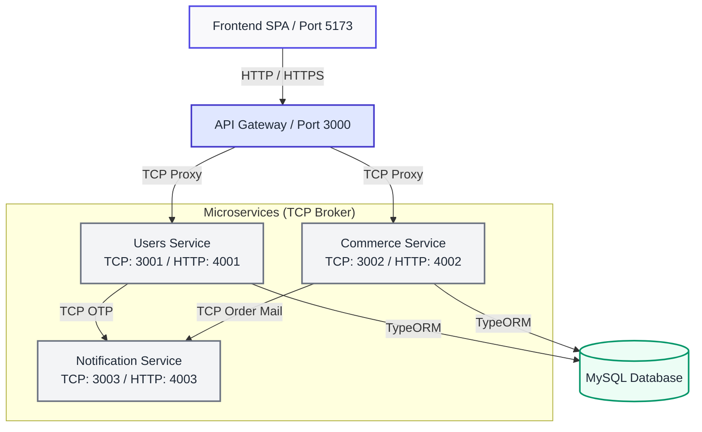

# LARASANA — Microservices Backend

Platform Digital Tenun Lombok — arsitektur microservices dengan NestJS monorepo.

---

## Arsitektur



---

## Cara Menjalankan

### 1. Prasyarat
* Node.js & npm
* MySQL Server (misal via XAMPP atau Docker)

### 2. Konfigurasi Environment
```bash
npm install
cp .env.example .env
# Lengkapi variabel di file .env sesuai kebutuhan
```

### 3. Menjalankan Service
```bash
# Jalankan semua service sekaligus (Windows)
start-all.bat

# Atau manual dengan npm run:
npm run start:users          # terminal 1
npm run start:commerce       # terminal 2
npm run start:notification   # terminal 3
npm run start:gateway        # terminal 4 (API Gateway)
```

Swagger API Docs dapat diakses di: `http://localhost:3000/api/docs`

---

## Database

Import SQL ke phpMyAdmin atau DBMS pilihan Anda:
1. `larasana_db.sql`

---

## Testing

Jalankan pengujian unit (unit tests) Jest:
```bash
npm test
```
